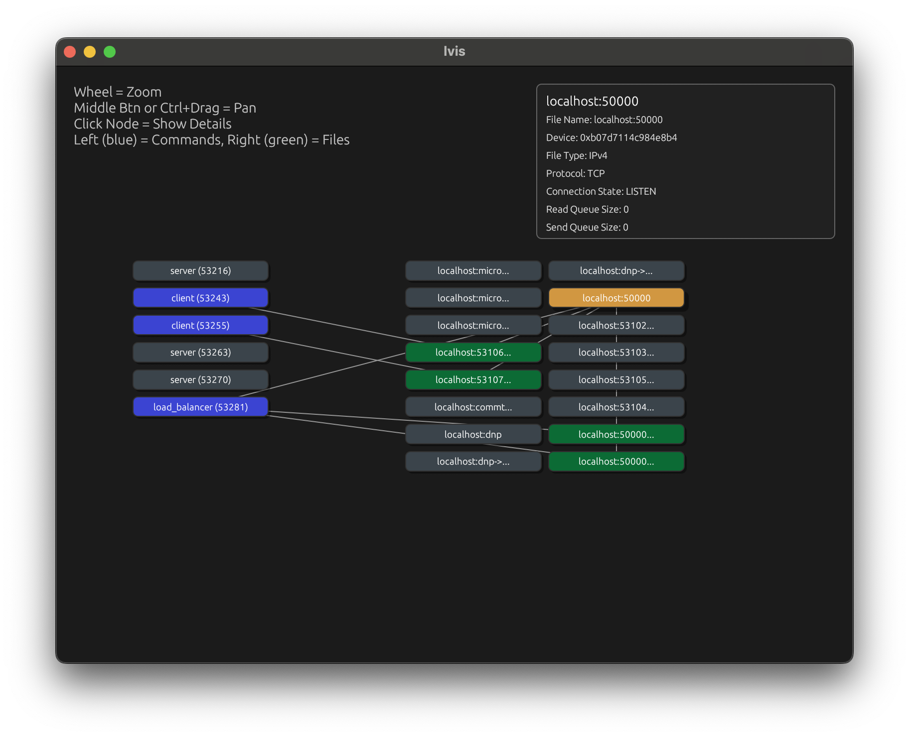
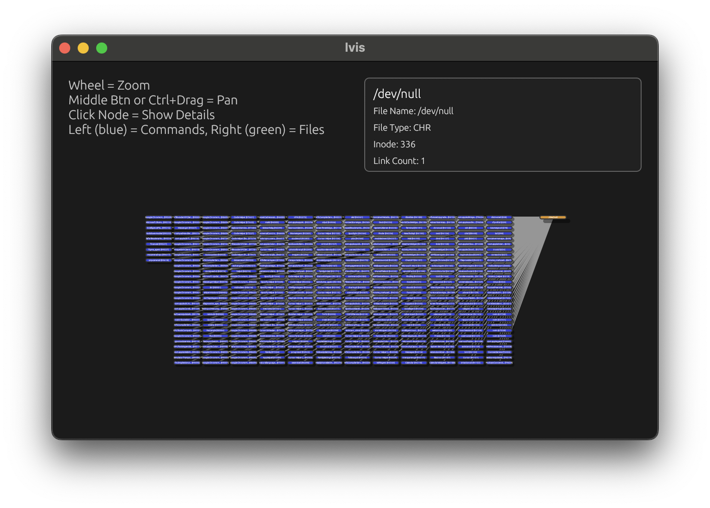
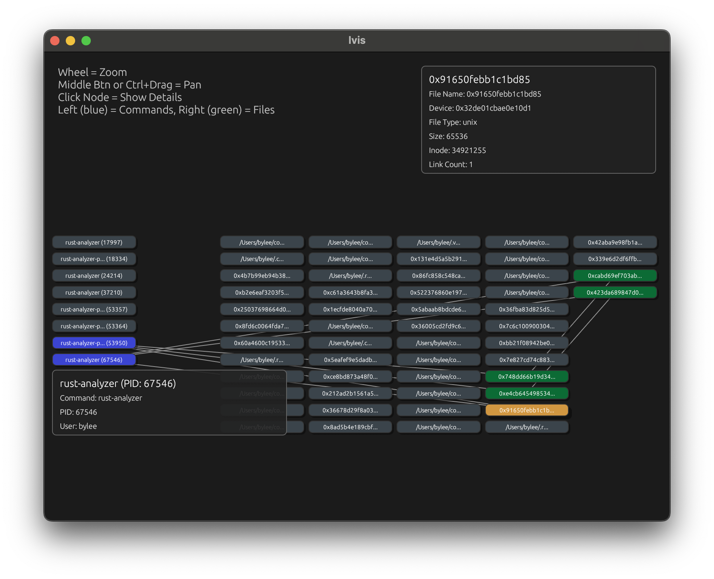

# `lvis` Visualize Process File Dependencies 📁
`lvis` (`lsof` visualization, the name sounds oddly like "elvis") is a graph visualization of `lsof` output. On UNIX based systems, `lsof` is a widely available utility which gives file info  about files opened by processes (you can try it on your system now! just run `lsof`). `lvis` displays the visualization as an interactive graphical user interface (GUI) popup window.

A file in UNIX can be many things, like a regular file, directory, internet socket, pipe, the list goes on. Multiple processes can open the same file (e.g. communicating via the same pipe, connected via the same UNIX socket, reading from the same regular file, writing to `/dev/null`). Sometimes the output of `lsof` is a big wall of text or the table formatmasks these connections between processes. 

`lvis` runs `lsof` and parses the [programmatic output](https://www.man7.org/linux/man-pages/man8/lsof.8.html#OUTPUT_FOR_OTHER_PROGRAMS) into a graphical format. 

`lvis` provides a visualization of these relationships. For example, this shows the port connections between processes running on `localhost`

## Getting Started
`lvis` can be installed as a binary executable via cargo

```
cargo install lvis
lvis -h
```

## Usage Examples
Here are a few example visualizations you can make with `lvis`.

### Visualize TCP Connections
View all processes using an address with the `localhost` hostname.

This shows a client/server/load balancer set up where the clients are connected to the load balancer (listening on port `50000` via TCP) and the clients are connected on (ephemeral) ports (`53106` and `53107`). 
```
# Visualizes: `lsof -i @localhost`
lvis -i @localhost
```



Created by:
1. Clicking `localhost:50000`, which highlights any processes listening on the port (`load_balancer`) and any connects to the port (`53106 <-> 50000` and `53107 <-> 50000`)
2. Clicking the other four TCP connections highlights the two client processes that initiated the connections

### Which processes use `/dev/null`?
Apparently a lot. 
```
# Visualizes: `lsof /dev/null`
lvis /dev/null
```


Similarly, can be used to view what processes are currently accessing a database file on disk, or a set of files in a directory. Also useful for when a mounted disk won't unmount because "target is busy" or can't delete a file because the file is in use.
```
# lsof +D /path/to/db/files
lvis +D /path/to/db/files
```

### Visualize pipe and socket connections
Let's see what files Rust analyzer (compiler frontend for Rust) uses. I have a few open (a few projects/editors). For one of these, this shows Rust analyzer has both a main rust analyzer process and a separate process for proc macro server process (to offload proc macro code generation load). They communicate via 3 channels - two pipes and 1 unix socket.
```
# Visualizes: `lsof -c rust-analyzer`
lvis -c rust-analyzer
```


Created by:
1. Clicking a rust analyzer process
2. Clicking the nodes with device names (names with hex codes) to identify sockets and pipes and recursively clicking devices that appear. Some are used by the proc macro process
3. Unclick the rust analyzer process (to focus on the device names)

Future work may include adding additional filters that `lsof` does not provide by default (and typically `grep` is used for) such as file name filtering (select all processes which have some file name matching a regex open) and file type filtering (filter for all unix sockets, pipes, etc).